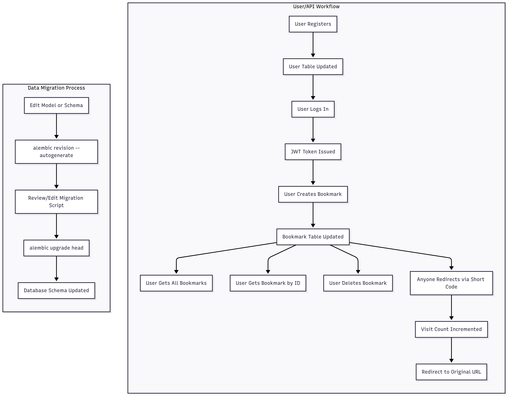
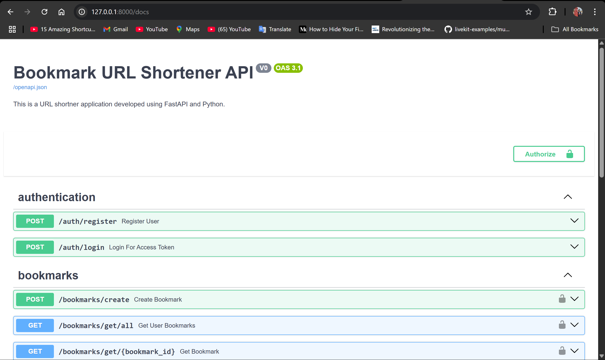

# Bookmark URL Shortener API

A modern, secure, and extensible URL shortener service built with FastAPI, SQLAlchemy (async), Alembic, and PostgreSQL.


## API Flow & Output

### API Workflow Diagram



### Example Output (Swagger UI)



## Data Migration Focus (Alembic, SQLAlchemy, PostgreSQL)

This project demonstrates robust data migration workflows using Alembic for schema and data changes, SQLAlchemy for ORM mapping, and PostgreSQL as the database backend. The migration process is automated and version-controlled, making it easy to evolve your database schema safely.


### Alembic Migration Graph

Below is a visual representation of the Alembic migration history for this project:


```text
<base>
  |
  |-- a9a344a9be94_first_commit
  |
  |-- b4d5b9d35e8d_add_default_to_created_at_and_updated_at
      |\
      | \
      |  |-- branch1_branch_from_b4d5b9d35e8d
      |  |-- d8157a9990d3_update_db
      | /
      |/
  |-- c420bea9650f_merge_branch1_and_d8157a9990d3 (mergepoint)
```

Each migration file represents a step in the evolution of the database schema. The mergepoint shows where branches were merged together.

---

### Migration Mapping Example

Suppose you want to split a `username` column into `first_name` and `last_name` columns. The migration steps are:

1. **Create new columns**: Add `first_name` and `last_name` to the `users` table.
2. **Migrate data**: Use SQL in the Alembic migration to split the `username` into the new columns.
3. **Drop old column**: Remove the `username` column after data migration.
4. **Update models**: Change your SQLAlchemy models to match the new schema.
5. **Update application logic**: Refactor authentication and user management to use the new fields.

#### Example Alembic Migration (Python)

```python
def upgrade():
    op.add_column('users', sa.Column('first_name', sa.String(length=56), nullable=True))
    op.add_column('users', sa.Column('last_name', sa.String(length=56), nullable=True))
    op.execute('''
        UPDATE users
        SET
            first_name = CASE
                WHEN POSITION(' ' IN username) > 0 THEN SUBSTRING(username FROM 1 FOR POSITION(' ' IN username) - 1)
                ELSE username
            END,
            last_name = CASE
                WHEN POSITION(' ' IN username) > 0 THEN SUBSTRING(username FROM POSITION(' ' IN username) + 1)
                ELSE NULL
            END
        WHERE username IS NOT NULL;
    ''')
    op.drop_column('users', 'username')
```

#### Example Model Update (SQLAlchemy)

```python
class User(Base):
    __tablename__ = 'users'
    id = Column(String(512), primary_key=True, index=True)
    email = Column(String(128), unique=True, index=True)
    first_name = Column(String(56))
    last_name = Column(String(56))
    # ... other fields ...
```

#### Example Postgres Query for Data Check

```sql
SELECT id, first_name, last_name FROM users;
```

#### Migration Mapping Table

| Old Field  | New Field(s)         | Migration Logic                                      |
|------------|----------------------|------------------------------------------------------|
| username   | first_name, last_name| Split on first space, assign to first/last name      |
| email      | email                | Unchanged                                            |
| hash_password | hash_password      | Unchanged                                            |

---

## Why This Project?

- **Problem:** Long URLs are hard to share, remember, and manage. There is a need for a simple, secure, and user-friendly way to shorten URLs, track usage, and manage bookmarks.
- **Solution:** This project provides a robust API for user registration, authentication, bookmark (URL) creation, redirection, and analytics, with a focus on clean code, security, and extensibility.

## Features

- User registration and JWT-based authentication
- Create short URLs (bookmarks) for any valid URL
- Redirect to the original URL using the short code
- Track visit counts for each bookmark
- Get all bookmarks for a user
- Get, delete bookmarks by ID
- Async database operations for high performance
- CORS support and enhanced logging

## Tech Stack

- **Backend:** FastAPI, SQLAlchemy (async), Alembic
- **Database:** PostgreSQL
- **Auth:** JWT (JSON Web Tokens)
- **Other:** Pydantic, passlib (bcrypt), requests (for testing)

## Project Structure

src/

```text
src/
  routes/
    auth.py         # Auth endpoints (register, login)
    bookmarks.py    # Bookmark CRUD endpoints
    redirects.py    # Redirection endpoint
  models/           # SQLAlchemy models
  schemas/          # Pydantic schemas
  utils/            # Auth, shortener, helpers
  main.py           # FastAPI app entrypoint
alembic/            # DB migrations
requirements.txt    # Python dependencies
```

## API Workflow

1. **Register a User**
   - `POST /auth/register`
   - Body: `{ "username": ..., "email": ..., "password": ... }`
   - Registers a new user. Returns user info.

2. **Login**
   - `POST /auth/login`
   - Body: `username`, `password` (form data)
   - Returns JWT access token.

3. **Create a Bookmark (Shorten URL)**
   - `POST /bookmarks/create`
   - Headers: `Authorization: Bearer <token>`
   - Body: `{ "original_url": "https://..." }`
   - Returns bookmark info with short code.

4. **Redirect**
   - `GET /<short_code>`
   - Redirects to the original URL and increments visit count.

5. **Get All Bookmarks**
   - `GET /bookmarks/get/all`
   - Headers: `Authorization: Bearer <token>`
   - Returns all bookmarks for the user.

6. **Get Bookmark by ID**
   - `GET /bookmarks/get/{bookmark_id}`
   - Headers: `Authorization: Bearer <token>`
   - Returns bookmark details.

7. **Delete Bookmark**
   - `DELETE /bookmarks/delete/{bookmark_id}`
   - Headers: `Authorization: Bearer <token>`
   - Deletes the bookmark if owned by the user.

## How to Run

1. **Clone the repo and install dependencies:**

   ```sh
   git clone <repo-url>
   cd FASTAPI_SQL
   python -m venv venv
   venv\Scripts\activate  # On Windows
   pip install -r requirements.txt
   ```

2. **Configure your database in `src/config.py`**
3. **Run Alembic migrations:**

   ```sh
   alembic upgrade head
   ```

4. **Start the server:**

   ```sh
   uvicorn src.main:app --reload
   ```

5. **Visit the docs:**
   - Open [http://localhost:8000/docs](http://localhost:8000/docs)

## Example Workflow (with Python requests)

See `test_login.py` for a full example of registration, login, bookmark creation, and retrieval.

## RTC (Ready To Contribute)

- The project is modular and ready for contributions.
- You can add features like custom domains, analytics, admin panel, etc.
- Please open issues or pull requests for suggestions and improvements.
